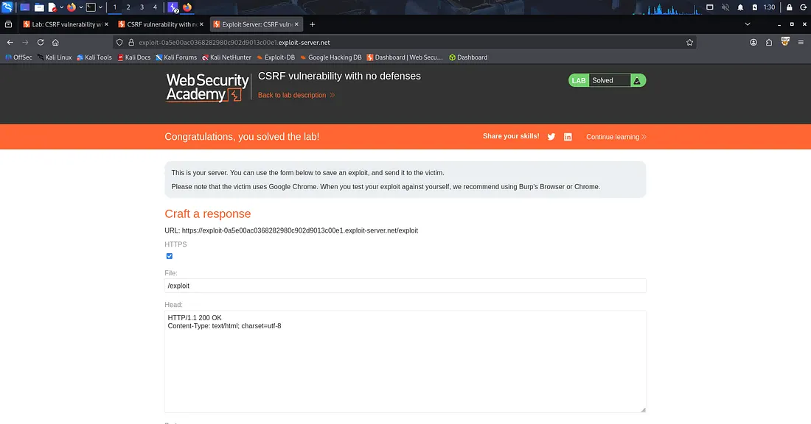
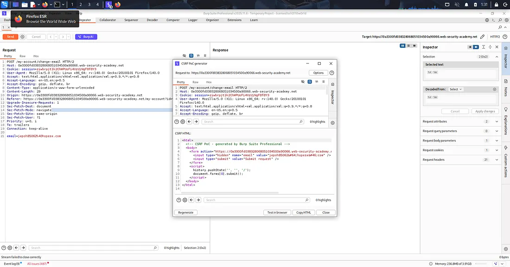

# CSRF Vulnerability with No Defenses

## Overview

In this lab, I exploited a **Cross-Site Request Forgery (CSRF)** vulnerability where the application had **no CSRF protections** implemented. The objective was to perform an unauthorized email change on a victim's account by creating and delivering a CSRF proof-of-concept (PoC).

> **Lab:** CSRF Vulnerability with No Defenses  
> **Platform:** PortSwigger Web Security Academy

---

## Objective

Demonstrate how an attacker can force an authenticated user to perform a sensitive action (changing their email address) without their knowledge when an application lacks CSRF protection.

---

## Steps Performed

### 1. Login

Logged into the lab using the provided credentials:

```text
Username: wiener
Password: peter
```

---

### 2. Analyze the Email Change Functionality

After logging in, I navigated to the **Change Email** page and changed the email once to understand how the application handled the request.

From this observation, I identified that:

- No CSRF token was present in the request.
- The application relied only on the session cookie.
- The email change functionality was vulnerable to CSRF.

---

### 3. Capture the Request

Using **Burp Suite**, I intercepted the request responsible for changing the email address.

I verified that:

- No anti-CSRF token existed.
- The request could be reproduced by another website while the victim was authenticated.

---

### 4. Generate a CSRF Proof of Concept

I used **Burp Suite's CSRF PoC Generator** to automatically generate an HTML exploit for the captured request.

The generated HTML automatically submits the forged request when opened by the victim.

---

### 5. Deliver the Exploit

I copied the generated HTML into the **Exploit Server**, stored the exploit, and clicked **Deliver exploit to victim**.

When the victim visited the exploit page, the malicious request executed automatically and changed the victim's email address.

---

## Result

The victim's email address was successfully changed without their knowledge.

✅ **Lab Solved Successfully**

---

# Screenshots

## 1. CSRF PoC Generated Using Burp Suite

This screenshot shows the intercepted email change request and the automatically generated CSRF Proof-of-Concept (PoC) using Burp Suite.



---

## 2. Lab Successfully Solved

After delivering the exploit to the victim through the Exploit Server, the lab was successfully completed.



---

## What I Learned

This lab helped me understand how Cross-Site Request Forgery (CSRF) attacks work when an application does not implement any CSRF protection.

Key takeaways:

- How attackers exploit authenticated user sessions.
- Why anti-CSRF tokens are important.
- How Burp Suite can automatically generate CSRF Proof-of-Concepts.
- The risks of relying only on session cookies for authentication.
- The importance of protecting sensitive actions such as changing account information.

Although I initially started the lab without reading the full description, completing it step by step gave me a clear understanding of how CSRF attacks work in real-world applications.

---

## Tools Used

- Burp Suite Professional
- PortSwigger Web Security Academy
- Exploit Server
- Firefox

---

## Security Recommendations

To prevent CSRF attacks, applications should implement:

- Anti-CSRF Tokens
- SameSite Cookie Attribute
- Origin Header Validation
- Referer Header Validation
- Re-authentication for Sensitive Actions
- User Confirmation Before Critical Changes

---

## Disclaimer

This project is created for **educational purposes only**.

All testing was performed in the authorized **PortSwigger Web Security Academy** lab environment.
