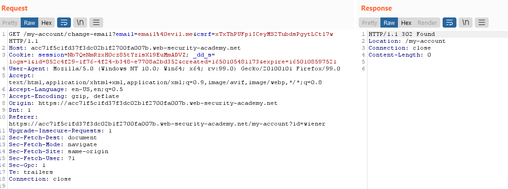

# CSRF Where Token Validation Depends on Request Method

## Overview

In this lab, I exploited a **Cross-Site Request Forgery (CSRF)** vulnerability caused by **improper CSRF token validation**. Although the application required a valid CSRF token for **POST** requests, it failed to enforce the same validation when the request method was changed to **GET**.

This inconsistency allowed an attacker to bypass the CSRF protection and perform unauthorized actions.

> **Lab:** CSRF where token validation depends on request method  
> **Platform:** PortSwigger Web Security Academy  
> **Difficulty:** Practitioner

---

## Lab Objective

Exploit the application's email change functionality by bypassing CSRF protection and changing a victim's email address without their consent.

---

## Login

Logged into the application using the provided credentials:

```text
Username: wiener
Password: peter
```

---

## Understanding the Protection

The application used a CSRF token for the **Change Email** functionality.

Initially, the implementation appeared secure because:

- A CSRF token was included in the request.
- The token was regenerated after each login.
- The token was tied to the user's session.
- Removing or leaving the token empty in a **POST** request caused the request to fail.

These observations suggested that CSRF protection was implemented correctly.

---

## Testing the Validation

To verify whether the protection was enforced consistently, I intercepted the email change request using **Burp Suite** and sent it to **Repeater**.

### Test 1 – Remove the CSRF Token (POST)

I removed the CSRF token completely from the POST request.

**Result:**

- Request rejected
- Application reported that the CSRF token was missing

This confirmed that POST requests required a valid token.

---

### Test 2 – Change Request Method

Next, I right-clicked the intercepted request in Burp Repeater and selected:

```
Change request method
```

The request was automatically converted from **POST** to **GET**.

After sending the modified request, the email changed successfully.

This indicated that the server was validating CSRF tokens only for POST requests and completely ignored them for GET requests.

---

### Test 3 – Remove the Token from the GET Request

Finally, I removed the CSRF token entirely from the GET request and sent it again.

**Result:**

The request still succeeded, confirming that GET requests bypassed CSRF validation.

---

## Creating the Exploit

Using **Burp Suite's CSRF PoC Generator**, I generated an HTML exploit for the vulnerable GET request.

The generated exploit:

- Sent a GET request
- Did not include a CSRF token
- Automatically submitted when opened by the victim

---

## Delivering the Exploit

I copied the generated HTML into the **Exploit Server**, then:

1. Stored the exploit.
2. Tested it.
3. Clicked **Deliver exploit to victim**.

When the victim visited the malicious page while logged in, the email address was changed automatically.

---

## Result

The victim's email address was successfully changed without requiring a valid CSRF token.

✅ **Lab Solved Successfully**

---

# Screenshots

## 1. POST Request Rejected Without CSRF Token

The application correctly rejected POST requests when the CSRF token was missing.

```md
![POST Request Without Token]images/aq.png
```

---

## 2. Request Method Changed to GET

The intercepted request was converted from POST to GET using Burp Repeater.

```md

```

---

## 3. GET Request Without CSRF Token

The GET request successfully changed the email even without a CSRF token.

```md

```

---

## 4. CSRF PoC Generated

Burp Suite automatically generated a Proof-of-Concept HTML exploit.

```md

```

---

---

## What I Learned

This lab demonstrated that implementing CSRF tokens alone is not enough.

Security controls must be enforced consistently across every request path.

### Key Takeaways

- CSRF protection must be validated for every HTTP method.
- Sensitive actions should never be accessible through GET requests.
- GET requests should remain safe and idempotent.
- Burp Suite Repeater is useful for identifying inconsistencies in request handling.
- Small implementation mistakes can completely bypass otherwise strong security mechanisms.

This lab reinforced the importance of testing different HTTP methods during web application security assessments.

---

## Tools Used

- Burp Suite Professional
- Burp Repeater
- Burp CSRF PoC Generator
- PortSwigger Web Security Academy
- Exploit Server
- Firefox

---

## Security Recommendations

Applications should implement the following protections:

- Validate CSRF tokens for every request method.
- Restrict state-changing operations to POST requests only.
- Reject GET requests for sensitive actions.
- Implement SameSite cookies.
- Validate the Origin and Referer headers.
- Require user confirmation or re-authentication for critical account changes.

---

## Disclaimer

This project is intended for **educational purposes only**.

All testing was performed within the authorized **PortSwigger Web Security Academy** lab environment.
